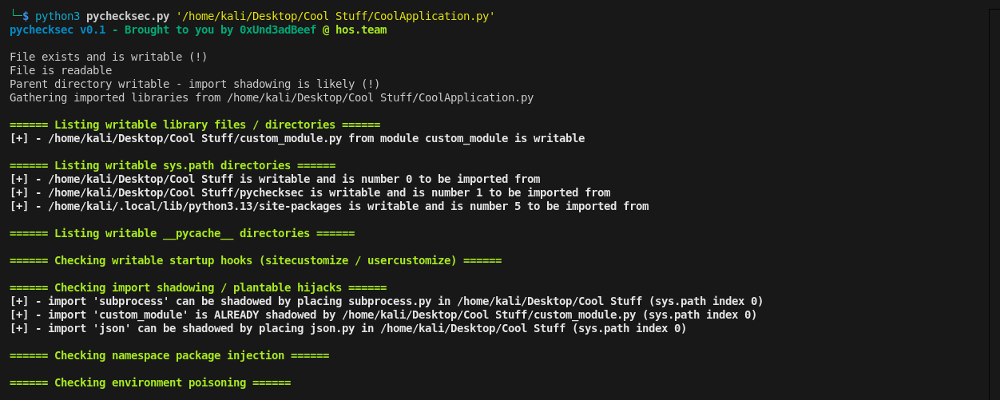

# pychecksec

`pychecksec` is a focused privesc enumeration tool that analyzes a target Python script
and its execution context to identify conditions that may allow code execution through
Python import resolution abuse / Library hijacking.


## What pychecksec checks

- Target script permissions
- Writable parent directories influencing import order
- Writable `sys.path` entries and their priority
- Imported modules resolved from writable locations
- Writable installed packages and library directories
- Writable `__pycache__` directories tied to imported modules
- Import shadowing opportunities (plantable `<module>.py`)
- Already shadowed imports resolved from local paths
- Writable Python startup hooks (`sitecustomize.py`, `usercustomize.py`)
- Namespace package injection conditions
- Environment-based import poisoning vectors


## Usage

```bash
python3 pychecksec.py /path/to/target.py
````

Example:

```bash
python3 pychecksec.py '/home/user/app/main.py'
```

## Output

Results are grouped by category and highlight:

* Writable paths that appear early in Python’s import order
* Imported modules resolving from user-writable locations
* Modules that are already shadowed or trivially shadowable

The output is fairly clear and straightforward for faster action.

Example output : 

```
└─$ python3 pychecksec.py '/home/kali/Desktop/Cool Stuff/CoolApplication.py'   
pychecksec v0.1 - Brought to you by 0xUnd3adBeef @ hos.team

File exists and is writable (!)
File is readable
Parent directory writable - import shadowing is likely (!)
Gathering imported libraries from /home/kali/Desktop/Cool Stuff/CoolApplication.py

====== Listing writable library files / directories ======
[+] - /home/kali/Desktop/Cool Stuff/custom_module.py from module custom_module is writable

====== Listing writable sys.path directories ======
[+] - /home/kali/Desktop/Cool Stuff is writable and is number 0 to be imported from
[+] - /home/kali/Desktop/Cool Stuff/pychecksec is writable and is number 1 to be imported from
[+] - /home/kali/.local/lib/python3.13/site-packages is writable and is number 5 to be imported from

====== Listing writable __pycache__ directories ======

====== Checking writable startup hooks (sitecustomize / usercustomize) ======

====== Checking import shadowing / plantable hijacks ======
[+] - import 'subprocess' can be shadowed by placing subprocess.py in /home/kali/Desktop/Cool Stuff (sys.path index 0)
[+] - import 'custom_module' is ALREADY shadowed by /home/kali/Desktop/Cool Stuff/custom_module.py (sys.path index 0)
[+] - import 'json' can be shadowed by placing json.py in /home/kali/Desktop/Cool Stuff (sys.path index 0)

====== Checking namespace package injection ======

====== Checking environment poisoning ======
                                                 
```

## Notes

* Please open an issue on the repo if you have any suggestions / bug reports.
* Contributions very welcome
* Intended for CTFs, labs, and real world privesc


## License

MPL v2
